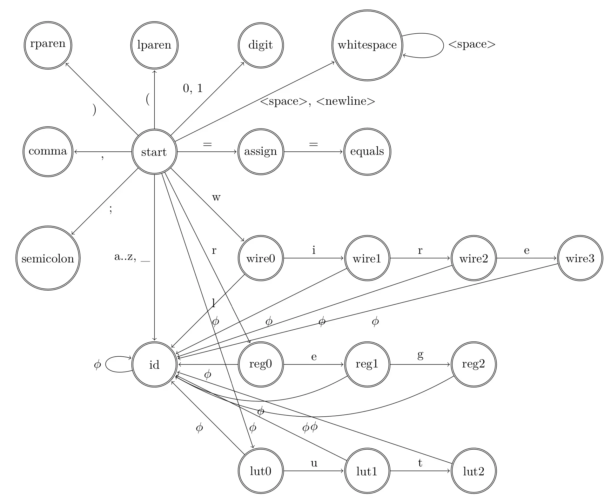

# CircuitScript Tokenizer

---

## How to Run

First, note that sample codes that will be lexed are stored under `./sample_code/*.circuit`.

1. Ensure docker is installed: https://docs.docker.com/engine/install/
2. Build the docker image as specified in the Dockerfile: `docker build -t circuit-script-compiler .`
3. Run the docker container: `docker run circuit-script-compiler`

The output of the script will show the tokenization outputs of the sample scripts stored under `./sample_code/*.circuit`.

---

## DFA

The DFA below is a partial representation of the language. For brevity, not all keywords were included.

To reduce verbosity, the φ transition represents the set of all lowercase ASCII letters, digits, and the underscore character, excluding any conflicting transitions the state might already have. For example, the φ transition from the `wire0` state contains 'a'-'z' excluding 'i', 0-9, and '\_'.



---

## Code Samples

We use a transition table (hash map of hash maps) called δ that maps `δ[state][transition] = next_state`:

```python
# dfa.py
δ[State.START] = {
    '0': State.DIGIT,
    '1': State.DIGIT,
    '(': State.LPAREN,
    ')': State.RPAREN,
    ';': State.SEMICOLON,
    ',': State.COMMA,
}

# Operators.
δ[State.START]['='] = State.OPERATOR_ASSIGN
δ[State.OPERATOR_ASSIGN]['='] = State.OPERATOR_EQUALITY

# Identifiers.
add_all(State.START, string.ascii_lowercase + '_', State.IDENTIFIER)
add_all(State.IDENTIFIER, LOWERCASE_AND_DIGITS_AND_UNDERSCORE, State.IDENTIFIER)

# Whitespace.
δ[State.START][' '] = State.WHITESPACE
δ[State.WHITESPACE][' '] = State.WHITESPACE
δ[State.START]['\n'] = State.WHITESPACE
```

Our main tokenizer loop is nearly 1:1 with the pseudocode provided in the class:

```python
# tokenizer.py
state = DFA.State.START
start = self.idx
end = self.idx

# Record last accepted state (if any) in case further searching isn't accepted.
# This also implements maximal munch as a byproduct.
last_accept_state = None
last_accept_end = end

while not self.eof(end) and state != DFA.State.ERROR:
    state = self.dfa.transition(state, self.src[end])
    if self.dfa.accepts(state):
        last_accept_state = state
        last_accept_end = end
    end += 1
```

---

## Error Handling

We don't allow syntax errors in programs. Code with any syntax errors will fail to compile. However, we _do_ recover and continue tokenizing after finding an error in order to find as many errors as possible. We report every syntax error to the user at once for ease of debugging. The error's location in the source code is also included.

---

## Lexical Specification

For the first iteration, we define the following tokens:

### KEYWORD

- `wire` - a wire in the digital circuit
- `reg` - register
- `lut` - Lookup Table (LUT)
- `and` - AND gate
- `or` - OR gate
- `not` - NOT gate
- `xor` - XOR gate
- `print` - prints content
- `if` - for if statements

### OPERATOR

- `=`
- `==`

### LPAREN

- `(`

### RPAREN

- `)`

### SEMICOLON

- `;`

### COMMA

- `,`

### DIGIT

- Any digits (0 - 9)

---

## Contributions

- Arie Arya, ana2175
- Jason Han, jjh2237
