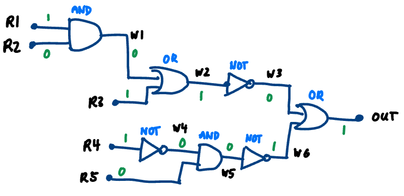
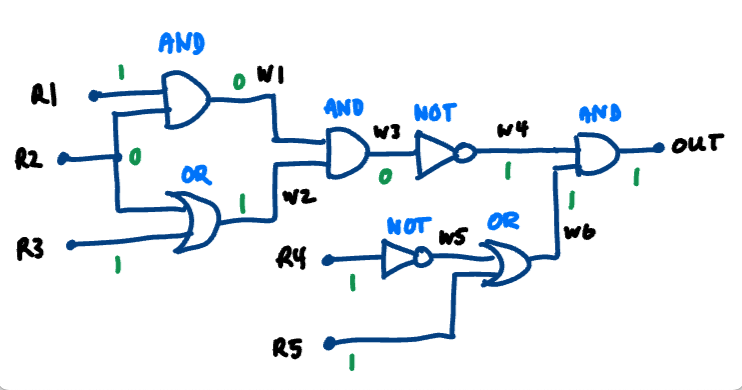
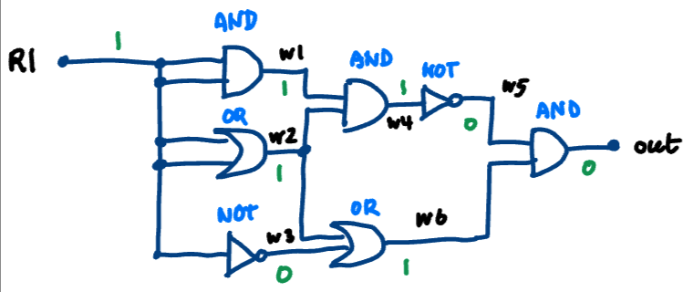

# Code Generation

The Python module used to implement the code generation can be found in code_generation.py. The class `CodeGenerator` takes an AST as an argument in its constructor, and its method `generate_ir` generates an intermediate representation in an assembly-like format (see example below).

This intermediate representation can then be run with our custom VM built on top of C++ (to minimize latency).

---

### Example - Big Circuit 1



For the circuit above, we can represent it with the following code (this can also be found in `sample_code/big_circuit_1.circuit`):

```
reg r1 = 1;
reg r2 = 0;
reg r3 = 1;
reg r4 = 1;
reg r5 = 0;

wire w1 = and(r1, r2);
wire w2 = or(w1, r3);
wire w3 = not(w2);
wire w4 = not(r4);
wire w5 = and(w4, r5);
wire w6 = not(w5);

wire out = or(w3, w6);

print(out);
```

After running the compiler (lexer, parser, and code generation), we obtain the following intermediate representation (IR):

```
LOAD r1, 1
LOAD r2, 0
LOAD r3, 1
LOAD r4, 1
LOAD r5, 0
AND t1, r1, r2
MOV w1, t1
OR t2, w1, r3
MOV w2, t2
NOT t3, w2
MOV w3, t3
NOT t4, r4
MOV w4, t4
AND t5, w4, r5
MOV w5, t5
NOT t6, w5
MOV w6, t6
OR t7, w3, w6
MOV out, t7
PRINT out
```

After running on the VM, we get the following output:

```
out = 1
```

---

### Example - Big Circuit 2



For the circuit above, we can represent it with the following code (this can also be found in `sample_code/big_circuit_2.circuit`):

```
reg r1 = 1;
reg r2 = 0;
reg r3 = 1;
reg r4 = 1;
reg r5 = 1;

wire w1 = and(r1, r2);
wire w2 = or(r2, r3);
wire w3 = and(w1, w2);
wire w4 = not(w3);
wire w5 = not(r4);
wire w6 = or(w5, r5);
wire out = and(w4, w6);

print(out);
```

After running the compiler (lexer, parser, and code generation), we obtain the following intermediate representation (IR):

```
LOAD r1, 1
LOAD r2, 0
LOAD r3, 1
LOAD r4, 1
LOAD r5, 1
AND t1, r1, r2
MOV w1, t1
OR t2, r2, r3
MOV w2, t2
AND t3, w1, w2
MOV w3, t3
NOT t4, w3
MOV w4, t4
NOT t5, r4
MOV w5, t5
OR t6, w5, r5
MOV w6, t6
AND t7, w4, w6
MOV out, t7
PRINT out
```

After running on the VM, we get the following output:

```
out = 1
```

---

### Example - Big Circuit 3



For the circuit above, we can represent it with the following code (this can also be found in `sample_code/big_circuit_3.circuit`):

```
reg r1 = 1;

wire w1 = and(r1, r1);
wire w2 = or(r1, r1);
wire w3 = not(r1);
wire w4 = and(w1, w2);
wire w5 = not(w4);
wire w6 = or(w2, w3);
wire out = and(w5, w6);

print(out);
```

After running the compiler (lexer, parser, and code generation), we obtain the following intermediate representation (IR):

```
LOAD r1, 1
AND t1, r1, r1
MOV w1, t1
OR t2, r1, r1
MOV w2, t2
NOT t3, r1
MOV w3, t3
AND t4, w1, w2
MOV w4, t4
NOT t5, w4
MOV w5, t5
OR t6, w2, w3
MOV w6, t6
AND t7, w5, w6
MOV out, t7
PRINT out
```

After running on the VM, we get the following output:

```
out = 0
```
